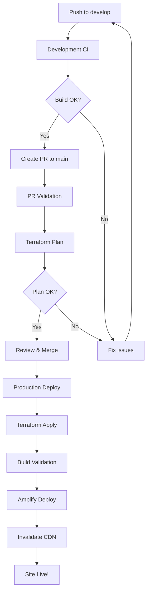

# CI/CD Workflow Documentation

**Last Updated:** 2026-02-05  
**Version:** 5.0  

---

## Overview

The S.Goodie Photography Platform uses GitHub Actions for CI/CD, deploying to AWS via:
- **AWS Amplify** for Next.js hosting
- **S3** for photo storage
- **CloudFront** for CDN
- **DynamoDB** for content storage
- **Terraform** for infrastructure as code

---

## Branch Strategy

```
feature branch → develop → PR → main → deploy
```

| Branch | Purpose | Auto Deploy? |
|--------|---------|--------------|
| `develop` | Active development, testing | No |
| `main` | Production-ready code | Yes |
| `feature/*` | Individual features | No |

---

## GitHub Workflows

### 1. Development CI (`develop-ci.yml`)
**Triggers:** Push to `develop` branch

**What it does:**
- Installs dependencies
- Runs linter
- Runs TypeScript check
- Builds Next.js

**Purpose:** Validates code before PR to main

### 2. PR Validation (`pr-validation.yml`)
**Triggers:** Pull request to `main`

**What it does:**
- Validates build
- Runs Terraform plan (preview changes)
- Comments plan on PR

**Purpose:** Review infrastructure changes before merge

### 3. Production Deploy (`deploy.yml`)
**Triggers:** Push to `main` (after PR merge)

**What it does:**
1. **Terraform Apply** - Creates/updates AWS infrastructure
2. **Build Validation** - Ensures Next.js builds
3. **Amplify Deploy** - Triggers production deployment
4. **Cache Invalidation** - Clears CloudFront cache

**Purpose:** Deploy to production

---

## AWS Infrastructure

### Resources Created by Terraform

| Resource | Purpose |
|----------|---------|
| Amplify App | Next.js hosting with SSR |
| S3 (photos) | Optimized images via CloudFront |
| S3 (uploads) | Original photo uploads |
| CloudFront | CDN for fast image delivery |
| DynamoDB (5 tables) | Content storage (pages, photos, projects, journal, analytics) |
| IAM Role (OIDC) | Secure GitHub Actions auth |

### Authentication

GitHub Actions authenticates to AWS using **OIDC** (OpenID Connect):
- No long-lived AWS access keys stored in GitHub
- Role assumption based on repository identity
- Automatic credential rotation

---

## GitHub Secrets

Required secrets in **Settings → Secrets and variables → Actions**:

| Secret | Description |
|--------|-------------|
| `AWS_ACCOUNT_ID` | AWS account ID (667516054009) |
| `GH_ACCESS_TOKEN` | GitHub PAT for Amplify |
| `NEXTAUTH_SECRET` | JWT encryption secret |
| `ADMIN_EMAIL` | Admin login email |
| `ADMIN_PASSWORD_HASH` | SHA256 of admin password |
| `OPENAI_API_KEY` | OpenAI API key (optional) |
| `INSTAGRAM_ACCESS_TOKEN` | Instagram token (optional) |

See `scripts/setup-github-secrets.md` for setup instructions.

---

## Deployment Flow



---

## Environment Variables

Environment variables are set in Amplify via Terraform:

| Variable | Source |
|----------|--------|
| `USE_MOCK_DATA` | Set to `false` in production |
| `NEXTAUTH_URL` | Derived from domain |
| `NEXTAUTH_SECRET` | GitHub Secret |
| `ADMIN_EMAIL` | GitHub Secret |
| `ADMIN_PASSWORD_HASH` | GitHub Secret |
| `OPENAI_API_KEY` | GitHub Secret |
| `AWS_S3_PHOTOS_BUCKET` | Terraform output |
| `AWS_CLOUDFRONT_URL` | Terraform output |

---

## Local Development

```bash
# Install dependencies
npm install

# Start development server
npm run dev
```

Server runs at `http://localhost:3000`

### Local AWS Testing (Optional)

```bash
# Start LocalStack
npm run localstack:start

# Setup resources
npm run setup:localstack

# Run with local AWS
USE_LOCALSTACK=true npm run dev
```

---

## Terraform Commands

```bash
cd terraform/environments/prod

# Initialize
terraform init

# Preview changes
terraform plan -var-file=terraform.tfvars

# Apply changes
terraform apply -var-file=terraform.tfvars

# View outputs
terraform output
```

---

## Troubleshooting

### Terraform State Lock
If terraform is stuck on a lock:
```bash
terraform force-unlock <LOCK_ID>
```

### Amplify Build Failure
Check the Amplify console for build logs:
https://us-east-1.console.aws.amazon.com/amplify/

### OIDC Authentication Error
Verify the trust policy allows your branch:
```bash
aws iam get-role --role-name sgoodie-github-actions-prod
```

---

## Quick Reference

| Action | Command/Steps |
|--------|---------------|
| Deploy to prod | Merge PR to `main` |
| Preview infra | Create PR, check Terraform plan comment |
| Check build status | View Actions tab in GitHub |
| View logs | AWS Amplify Console |
| Invalidate cache | Automatic after deploy |

---

**Document Version:** 5.0  
**Last Updated:** 2026-02-05
