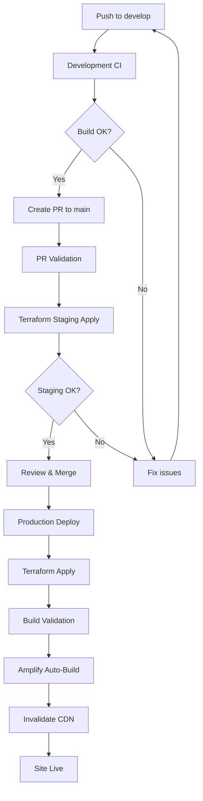

# CI/CD Workflow Documentation

**Last Updated:** 2026-02-05  
**Version:** 6.0  

---

## Overview

The S.Goodie Photography Platform uses GitHub Actions for CI/CD, deploying to AWS via:
- **AWS Amplify (SSR)** for Next.js hosting
- **DynamoDB** for content and analytics storage
- **S3** for photo storage
- **CloudFront** for CDN
- **Terraform** for infrastructure as code

Amplify builds automatically on pushes to `main`. GitHub Actions ensures infrastructure is applied and caches are invalidated.

---

## Branch Strategy

```
feature branch -> develop -> PR -> main -> deploy
```

| Branch | Purpose | Auto Deploy? |
|--------|---------|--------------|
| `develop` | Active development, testing | No |
| `main` | Production-ready code | Yes |
| `feature/*` | Individual features | No |

---

## GitHub Workflows

### 1. Development CI (`develop-ci.yml`)
**Triggers:** Push to `develop`

**What it does:**
- Installs dependencies
- Runs linter
- Runs TypeScript check
- Builds Next.js

### 2. PR Validation (`pr-validation.yml`)
**Triggers:** Pull request to `main`

**What it does:**
- Validates build
- Applies Terraform to staging to catch real infra issues
- Runs a production plan preview

### 3. Production Deploy (`deploy.yml`)
**Triggers:** Push to `main` (after PR merge)

**What it does:**
1. **Terraform Apply** - Creates/updates AWS infrastructure
2. **Build Validation** - Ensures Next.js builds
3. **Amplify Deploy** - Amplify auto-builds from `main`
4. **Cache Invalidation** - Clears CloudFront cache

---

## AWS Infrastructure

### Resources Created by Terraform

| Resource | Purpose |
|----------|---------|
| Amplify App (WEB_COMPUTE) | Next.js SSR hosting |
| IAM Service/Compute Role | Runtime DynamoDB access for SSR |
| S3 (photos) | Optimized images via CloudFront |
| S3 (uploads) | Original photo uploads |
| CloudFront | CDN for fast image delivery |
  | DynamoDB (6 tables) | Content + analytics + admin auth |
  | IAM Role (OIDC) | Secure GitHub Actions auth |

### Amplify Runtime Details
- **Compute role** grants DynamoDB access for SSR
- **Build spec writes env vars to `.env.production`** for runtime access
- No custom rewrite rules needed (Next.js SSR handles routing)

---

## GitHub Secrets

Required secrets in **Settings -> Secrets and variables -> Actions**:

| Secret | Description |
|--------|-------------|
| `AWS_ACCOUNT_ID` | AWS account ID for OIDC role |
| `GH_ACCESS_TOKEN` | GitHub PAT for Amplify app creation |
| `NEXTAUTH_URL` | Production URL for NextAuth |
| `NEXTAUTH_SECRET` | JWT encryption secret |
| `ADMIN_EMAIL` | Seed admin login email |
| `ADMIN_PASSWORD_HASH` | Seed admin password hash |
| `OPENAI_API_KEY` | OpenAI API key (optional, stored in Secrets Manager) |
| `INSTAGRAM_ACCESS_TOKEN` | Instagram token (optional, stored in Secrets Manager) |
  | `AMPLIFY_CLOUDFRONT_DISTRIBUTION_ID` | CloudFront distribution ID for cache invalidation |

Notes:
- `ADMIN_EMAIL` and `ADMIN_PASSWORD_HASH` seed the DynamoDB admin record on first run.
- After seeding, admin credentials are updated in DynamoDB via the Profile page.

---

## Environment Variables (Amplify)

Amplify environment variables are set via Terraform and written to `.env.production` during build for SSR access.

Common variables:
- `USE_MOCK_DATA=false`
- `NEXTAUTH_URL`
- `NEXTAUTH_SECRET`
- `ADMIN_EMAIL`
- `ADMIN_PASSWORD_HASH`
- `OPENAI_API_KEY_SECRET_ID` (optional)
- `INSTAGRAM_ACCESS_TOKEN_SECRET_ID` (optional)
- `DYNAMODB_TABLE_PREFIX`
- `DYNAMODB_TABLE_ENV`
- `DYNAMODB_REGION`
- `S3_PHOTOS_BUCKET`
- `S3_UPLOADS_BUCKET`
- `CLOUDFRONT_URL`

---

## Deployment Flow



---

## Local Development

```bash
npm install
npm run dev
```

Server runs at `http://localhost:3000`

---

## Troubleshooting

### Amplify Build Failure
Check Amplify console for build logs.

### OIDC Authentication Error
Verify the role trust policy allows your repo/branch:
```bash
aws iam get-role --role-name sgoodie-github-actions-prod
```

---

**Document Version:** 6.0  
**Last Updated:** 2026-02-05
